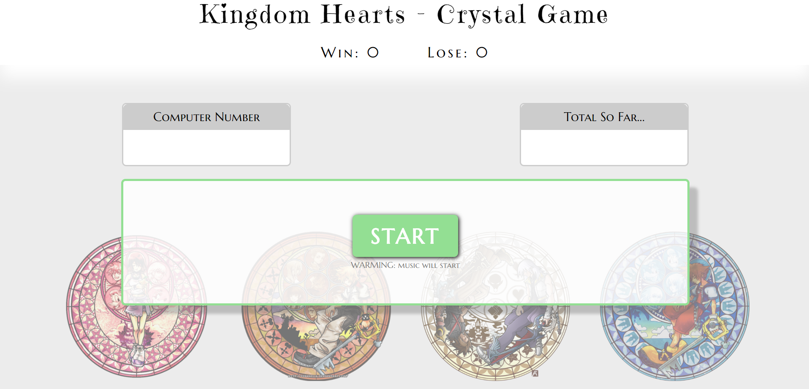
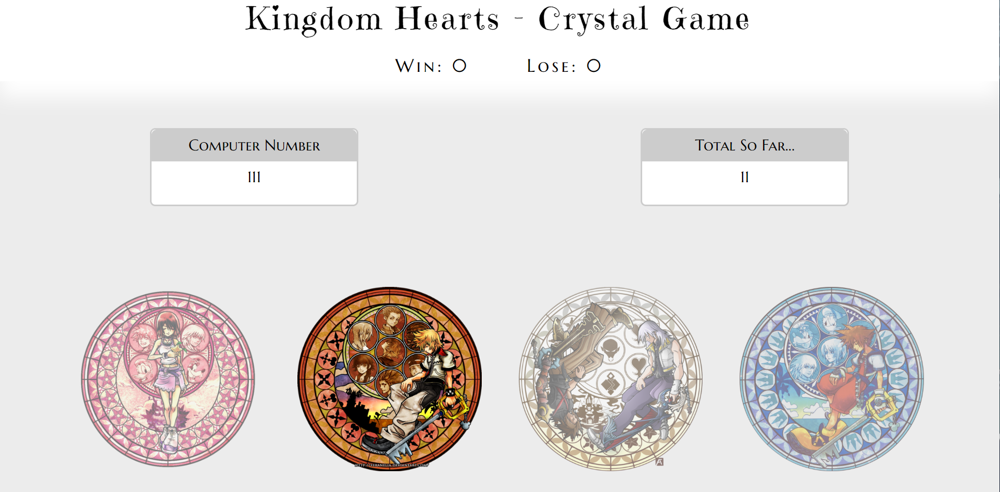

# crystal-game
JQuery Assignment -- crystal game

# Finished Product:

# Game Play:
<pre>
- Click Start to play... duh

- WARNING: There will be background music in this game
    music title: Musique pour la Tristesse de Xion

- The goal of the game is to match your number with the computer's number

- To increase your points, you will have to click the four stations on the bottom each having their own random number.

- Add up your points to equal the computer's and YOUR WIN POINT GOES UP BY 1 WHOLE POINT! -- pat yourself on the back

- Go above the computer's points and YOU HAVE DESTROYED THE KINDOM HEARTS WORLDS!!! LIFE AS WE KNOW IT IS OVER!! -- haha just kidding you will just increase you lose points by 1

ENJOY!

</pre>

### CrystalsCollector Game (Recommended)

1. Watch the demo

2. The player will have to guess the answer, just like in Word Guess. This time, though, the player will guess with numbers instead of letters. 

3. Here's how the app works:

   * There will be four crystals displayed as buttons on the page.

   * The player will be shown a random number at the start of the game.

   * When the player clicks on a crystal, it will add a specific amount of points to the player's total score. 

     * Your game will hide this amount until the player clicks a crystal.
     * When they do click one, update the player's score counter.

   * The player wins if their total score matches the random number from the beginning of the game.

   * The player loses if their score goes above the random number.

   * The game restarts whenever the player wins or loses.

     * When the game begins again, the player should see a new random number. Also, all the crystals will have four new hidden values. Of course, the user's score (and score counter) will reset to zero.

   * The app should show the number of games the player wins and loses. To that end, do not refresh the page as a means to restart the game.

##### Option 1 Game design notes

* The random number shown at the start of the game should be between 19 - 120.

* Each crystal should have a random hidden value between 1 - 12.